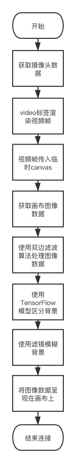
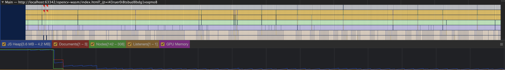

# 视频会议图像处理的纯web实现

随着全球疫情的蔓延，越来越多的组织选择了网上上课或者会议，各种各样的视频会议软件也应运而生。但是市面上网页版的视频会议工具仿佛还是很难见到，究竟什么制约的web在这个领域的发展？在WebRTC、Web Worker、WebAssembly等技术成熟的背景下，是否能通过更底层的语言和多线程实现流畅的视频处理体验呢？带着这些问题我做了如下尝试。


## 重点需求分析

参考了一些现有的视频会议软件，我发现背景虚化和美颜是相对比较重要的功能，对于保护隐私和视频效果有些很大的帮助，甚至可能决定了用户是否愿意打开摄像头。同时这也是比较考验性能部分，对前端的性能优化有着很强的挑战。

## 需求拆解

核心流程如图：


### 获取摄像头数据

这一步主要是通过`navigator.mediaDevices.getUserMedia`API来实现，之前使用的`navigator.getUserMedia`已经废弃，但是旧版本的浏览器可能还在使用旧版API，可以通过安装`webrtc-adapter`npm包来兼容旧版浏览器。

### 显示摄像头画面

获取到摄像头数据以后可以通过video元素直接展示出来，具体实现的伪代码如下：
```js
const userMediaOptions = {
  audio: false, 
  video: { facingMode: 'user' },
};
const { getUserMedia } = navigator.mediaDevices;
video.srcObject = await getUserMedia(userMediaOptions);
video.play();
```
如果浏览器video元素不支持srcObject属性的话，也可以通过`window.URL.createObjectURL`方法将stream数据转换后直接赋值给video元素src属性来实现。

### 视频处理


## 背景虚化实现

### tensorflow.js

模糊背景的效果可以使用`bodyPix.drawBokehEffect`方法快速实现，不过这并不是一个纯函数，并且会直接操作canvas元素，所以想通过`web Worker`的方式解决性能问题是行不通的。实际上`net.segmentPerson`返回的已经是非常有效的数据了，`segmentation.data`是一个`Uint8Array`，它和`ctx.getImageData`返回的`Uint8Array`虽然不一样但是是有对应关系的。`ctx.getImageData`返回的数据最小值是0，最大值为255，每四个为一组代表一个像素的RGBA值。而`segmentation.data`返回的数据则比较纯粹，一个值就是一个像素，值的范围只有0和1，分别代表不属于人体的像素和属于人体的像素。

### Web Worker

## 美颜磨皮实现

目前来看，现有算法中对于保护边缘细节最好的应该就是双边滤波了，在PS中的表面模糊功能也是基于这个算法实现的。

### 双边滤波（bilateralFilter）

### WebAssembly

目前我了解到的市面上有3种编译WebAssembly的方式，分别是emscripten、wasm-pack和webassembly.studio三种方式，它们各有利弊。

#### emscripten

主要支持语言: C/C++

优点：

相对而言最成熟最稳定，支持直接编译为asm.js，支持源码sourcemap调试 。

缺点：

安装依赖时可能要考虑python3和python2的共存问题，安装体验不是特别好。会生成一个js胶水代码文件，必须按照他提供的模块化方法组织代码，对于现在普遍使用打包工具工程化的项目不是很友好。

#### wasm-pack

仅支持Rust

优点：

wasm-pack有npm包的版本,并且有带文件监听自动编译的webpack插件，使用体验非常接近现在主流的web开发方式。

缺点：

目前仅支持Rust，也会生成js胶水代码文件，目前感觉不是很稳定，会出现显示编译成功但是没有产物的问题。

#### webassembly.studio

支持C、TS和Rust

优点：

在线创建和编译，无需安装编译环境。不生成且无需使用js胶水代码文件。

缺点：

暂时不支持C++，不支持创建.h文件。

#### 使用opencv.wasm

通过emscripten工具可以很方便生成opencv的wasm页面，同时还附带一个胶水js和一个html页面。具体使用方式可以看参考资料的最后一条。

使用时候整体性能表现也是非常的不错。虽然运行在主线程中，每个任务基本都能在50ms内完成，相比之前的纯js方案已经有了非常大的提升。



#### GC回收

在运行了一段时间后还是发现了一个问题，视频会突然卡住，控制台报错："Cannot enlarge memory arrays"。可是performance面板中的JS Heap明明才3.6MB-4.2MB的占用，而且从曲线上也完全没有上升的趋势，内存怎么就溢出了呢？

通过浏览器自带的任务管理器发现当前tab页的内存使用竟已经2.2GB,才想起来WebAssembly中有些语言是需要自己垃圾回收的。在每次绘制canvas完成后回收掉之前创建的矩阵数据。

```js
function drawCanvas() {
  cap.read(src);
  const mat = new cv.Mat();
  const dstC3 = new cv.Mat(videoHeight, videoWidth, cv.CV_8UC3);
  cv.cvtColor(src, mat, cv.COLOR_RGBA2RGB);
  cv.bilateralFilter(mat, dstC3, 5, 75, 75, 4);
  cv.imshow(inputCanvas, dstC3);
  // GC回收
  mat.delete();
  dstC3.delete();
  requestAnimationFrame(drawCanvas)
}
```

#### 其他问题

想要用好WebAssembly也面临一些问题，比如想要更优雅导入wasm文件，可能需要一些加载器。opencv是一个很大的库（6M+），如何按需加载我用到的函数？提取出来的函数能否运行在Web Worker中进一步提升性能？

##### loader

我执意想通过webpack的loader方式导入wasm文件，但发现似乎是一条行不通的路。首先是WebAssembly的loader实现就不多，目前能找到的最多star的项目是[wasm-loader](https://github.com/ballercat/wasm-loader)。

尝试过用各种姿势使用都没有办法跑起来。最近维护时间是3年前，我遇到的问题跟最新一条issues类似，作者的回复是"感谢你报告这个问题，我有时间的话就修复一下"。其他的也都试过没有找到一个能用的。使用不了这个loader应该跟wasm必须通过异步方式载入有关系，所以后来还是改用异步解决问题。

```js
export default (filename, imports = {}) => fetch(filename)
  .then((response) => response.arrayBuffer())
  .then((buffer) => {
    imports.env = imports.env || {};
    Object.assign(imports.env, {
      memoryBase: 0,
      tableBase: 0,
      memory: new WebAssembly.Memory({ initial: 256 }),
      table: new WebAssembly.Table({ initial: 0, maximum: 0, element: 'anyfunc' }),
    });
    return WebAssembly.instantiate(buffer, imports);
  })
  .then((results) => results.instance);
```

##### 按需加载
想要实现按需加载，就需要对opencv的源码进行分析，

workerpool、promise-worker、threads.js

## 参考资料

[ImageFilters.js](https://github.com/zhengsk/ImageFilters.js)

[color-pop-effect-using-bodypix-and-tensorflow-js](https://towardsdatascience.com/color-pop-effect-using-bodypix-and-tensorflow-js-a584ddc48a02)

[imageRoutines](https://github.com/m0ose/imageRoutines)

[c++项目转成wasm全过程](https://zhuanlan.zhihu.com/p/158586853)

[emscripten-pointers-and-pointers](https://kapadia.github.io/emscripten/2013/09/13/emscripten-pointers-and-pointers.html)

[opencv-wasm](https://github.com/yaniswang/opencv-wasm)
