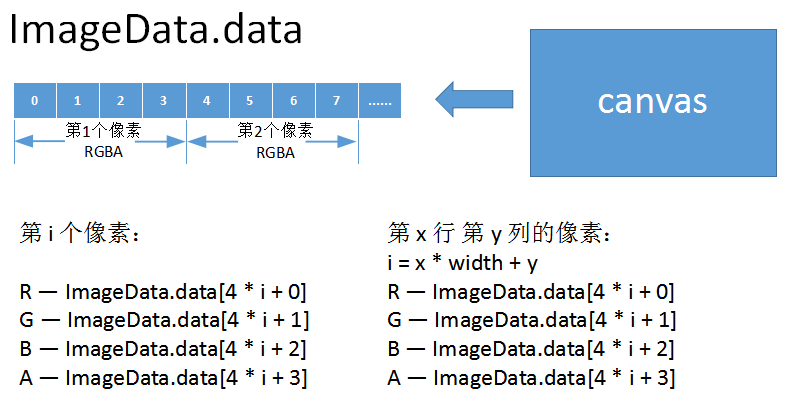
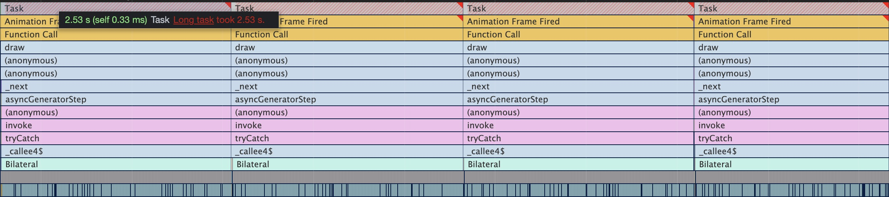
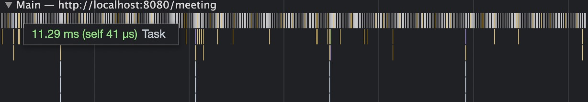
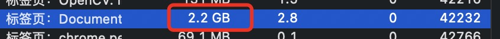

# 视频会议图像处理的纯web实现

随着全球疫情的蔓延，越来越多的组织选择了网上上课或者会议，各种各样的视频会议软件也应运而生。但是市面上网页版的视频会议工具仿佛还是很难见到，究竟什么制约的web在这个领域的发展？在WebRTC、Web Worker、WebAssembly、Web GUP等技术逐步出现的背景下，是否能通过更底层的语言和多线程实现流畅的视频处理体验呢？带着这些问题我做了如下尝试。

## 重点需求分析

参考了一些现有的视频会议软件，我发现背景虚化和美颜是相对比较重要的功能，对于保护隐私和提升视频效果有些很大的帮助，甚至可能决定了用户是否愿意打开摄像头。同时这也是比较考验性能部分，对前端的性能优化有着很大的挑战。

## 需求实现过程

### 获取摄像头数据

这一步主要是通过`navigator.mediaDevices.getUserMedia`API来实现，之前使用的`navigator.getUserMedia`已经废弃，但是旧版本的浏览器可能还在使用旧版API，可以通过安装`webrtc-adapter`npm包来兼容旧版浏览器。

### 显示摄像头画面

获取到摄像头数据以后可以通过video元素直接展示出来，具体实现的伪代码如下：
```js
const userMediaOptions = {
  audio: false, 
  video: { facingMode: 'user' },
};
const { getUserMedia } = navigator.mediaDevices;
video.srcObject = await getUserMedia(userMediaOptions);
video.play();
```
如果浏览器video元素不支持srcObject属性的话，也可以通过`window.URL.createObjectURL`方法将stream数据转换后直接赋值给video元素src属性来实现。

### 视频处理

视频处理我们是通过将视频帧绘制在canvas中，然后通过`getImageData`获取视频帧图像矩阵数据。视频矩阵数据和普通图片矩阵数据一样是`Uint8ClampedArray`格式数据,每个元素的值是0-255的正整数，每四个元素代表一个像素数据（RGBA）。此时我们就可以通过一些图形图像算法对这些数据进行处理了。



### 美颜磨皮实现

目前来看，现有算法中对于保护边缘细节最好的应该就是双边滤波了。双边滤波（Bilateral filter）是一种非线性的滤波方法，是结合图像的空间邻近度和像素值相似度的一种折衷处理，同时考虑空域信息和灰度相似性，达到保边去噪的目的。具有简单、非迭代、局部的特点。缺点就是对性能的挑战极大。

首先我们使用js代码尝试能否满足需求（代码很长而且也不是最终方案，所以就不贴代码了）。

答案是否定的，我们来看下性能分析。



可以看到主线程的一个task需要2秒+执行完成。都卡成幻灯片了，页面很难交互。

### 使用Web Worker优化

通过多线程的方式减少主线程的压力是否可以改善这种情况呢？

这里我选用了[threads.js]()库作为Web Worker创建和管理的工具，它在github有1.4k的star，支持多种环境，并且可以通过webpack插件进行构建。

经过多线程的优化后，我们可以看到此时的主线程中的任务耗时减少到10ms+了，但是视频的卡顿并没有得到缓解。



因为运算已经转移到了Worker线程，可以看到Worker线程中的任务时间跟优化前主线程的运行时间是差不多的。对于这种视频场景而言工作量并没有减少，只是转移了工作量。但画面渲染始终需要等运算完成才能呈现。只不过这样就不会影响页面其他操作而已，结果自然是是治标不治本的。


### 使用WebAssembly优化

目前我了解到的市面上有3种编译WebAssembly的方式，分别是emscripten、wasm-pack和webassembly.studio三种方式，它们各有利弊。

#### emscripten

主要支持语言: C/C++

优点：

相对而言最成熟最稳定，支持直接编译为asm.js，支持源码sourcemap调试 。

缺点：

安装依赖时可能要考虑python3和python2的共存问题，安装体验不是特别好。必须按照他提供的模块化方法组织代码，对于现在普遍使用打包工具工程化的项目不是很友好。

#### wasm-pack

仅支持Rust

优点：

wasm-pack有npm包的版本,并且有带文件监听自动编译的webpack插件，使用体验非常接近现在主流的web开发方式。

缺点：

目前仅支持Rust，目前感觉不是很稳定，会出现显示编译成功但是没有产物的问题。

#### webassembly.studio

支持C、TS和Rust

优点：

在线创建和编译，无需安装编译环境。

缺点：

虽然支持C不支持C++，不支持创建.h文件。

#### 使用opencv.wasm

opencv是一个非常强大的计算机视觉库，内置了bilateralFilter，并且支持编译成wasm文件，基本是满足我们需求的。

通过emscripten工具可以很方便生成opencv的wasm页面，同时还附带一个胶水js和一个html页面。具体生成方式可以看参考资料的最后一条。

也可以直接使用`opencv.js-webassembly`这个npm包，这个包使用起来非常方便，并且将opencv所有的方法都暴露在js胶水代码中，方便业务代码调用。

使用时候整体性能表现也是非常的不错。虽然运行在主线程中，每个任务基本都能在50ms内完成，相比之前的纯js方案已经有了非常大的提升。


#### GC回收

在运行了一段时间后还是发现了一个问题，视频会突然卡住，控制台报错："Cannot enlarge memory arrays"。可是performance面板中的JS Heap明明才3.6MB-4.2MB的占用，而且从曲线上也完全没有上升的趋势，内存怎么就溢出了呢？

通过浏览器自带的任务管理器发现当前tab页的内存使用竟已经2.2GB,才想起来WebAssembly中有些语言是需要自己垃圾回收的。在每次绘制canvas完成后回收掉之前创建的矩阵数据。



```js
export default async (src, width, height, quality) => {
  if (cv.calledRun) {
    // ImageData对象转Mat对象
    const mat = cv.matFromArray(height, width, cv.CV_8UC4, src);
    // 4通道mat对象转3通道mat（bilateralFilter仅支持1或者3通道，ImageData是4通道）
    cv.cvtColor(mat, mat, cv.COLOR_RGBA2RGB, 0);
    const temp = new cv.Mat(height, width, cv.CV_8UC3);
    await cv.bilateralFilter(mat, temp, quality, 75, 75, cv.BORDER_DEFAULT);
    cv.cvtColor(temp, temp, cv.COLOR_RGB2RGBA);
    // temp.data是数据引用，直接return会报错，构造新的Uint8ClampedArray数据
    const dst = Uint8ClampedArray.from(temp.data);
    // GC
    mat.delete();
    temp.delete();
    return dst;
  }
  return src;
};
```

#### 其他问题

opencv是一个很大的库（6M+），如何按需加载我用到的函数？而且现在quality设置到最低的情况下才能有较好的性能表现，但是这样的美颜效果是不明显的。

### WebGL

目前WebGUP功能并没有发布，所以我们还是尝试使用WebGL来实现双边滤波的运算。

## 背景虚化实现

背景虚化的功能可以借助tfjs的BodyPix模型，BodyPix模型可以实时分割人物身体和背景，并且提供`bodyPix.drawBokehEffect`方法快速实现背景虚化，不过这并不是一个纯函数，并且会直接操作canvas元素，所以想通过`web Worker`的方式解决性能问题是行不通的。实际上`net.segmentPerson`返回的已经是非常有效的数据了，`segmentation.data`是一个`Uint8Array`，它和`ctx.getImageData`返回的`Uint8Array`虽然不一样但是是有对应关系的。`ctx.getImageData`返回的数据最小值是0，最大值为255，每四个为一组代表一个像素的RGBA值。而`segmentation.data`返回的数据则比较纯粹，一个值就是一个像素，值的范围只有0和1，分别代表不属于人体的像素和属于人体的像素。

有了这些数据以后可以通过

## 总结

以目前的项目实现来看还是有很多不足的，比如加载的文件过大，使用opencv实现的美颜还是存在的性能问题和美颜效果也不是特别理想的情况

## 愿景

如果有同学对这个项目或者课题感兴趣的话，欢迎加入进来共同创建一个oteam。

## 参考资料

[ImageFilters.js](https://github.com/zhengsk/ImageFilters.js)

[color-pop-effect-using-bodypix-and-tensorflow-js](https://towardsdatascience.com/color-pop-effect-using-bodypix-and-tensorflow-js-a584ddc48a02)

[imageRoutines](https://github.com/m0ose/imageRoutines)

[c++项目转成wasm全过程](https://zhuanlan.zhihu.com/p/158586853)

[emscripten-pointers-and-pointers](https://kapadia.github.io/emscripten/2013/09/13/emscripten-pointers-and-pointers.html)

[opencv-wasm](https://github.com/yaniswang/opencv-wasm)
