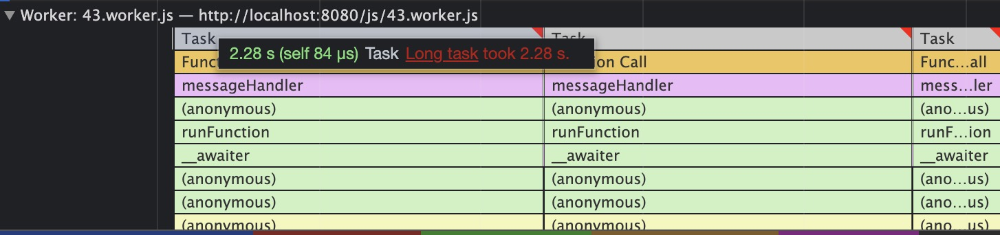
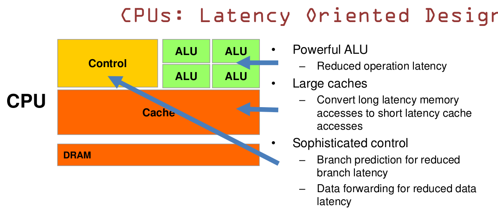
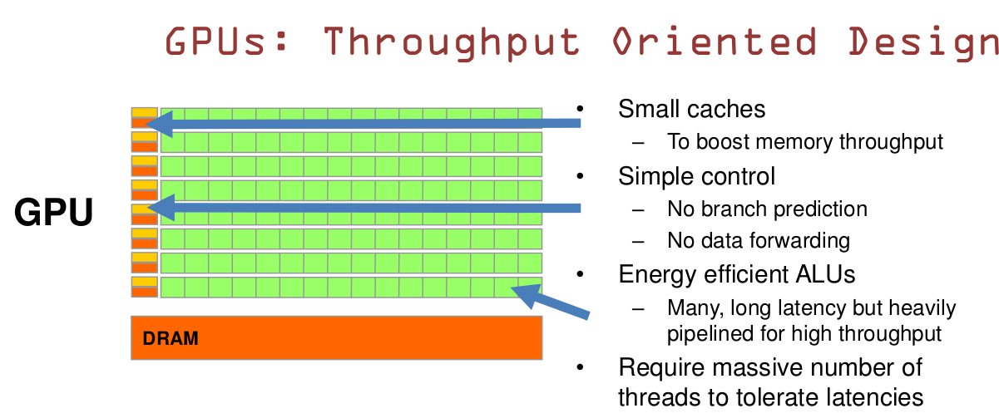
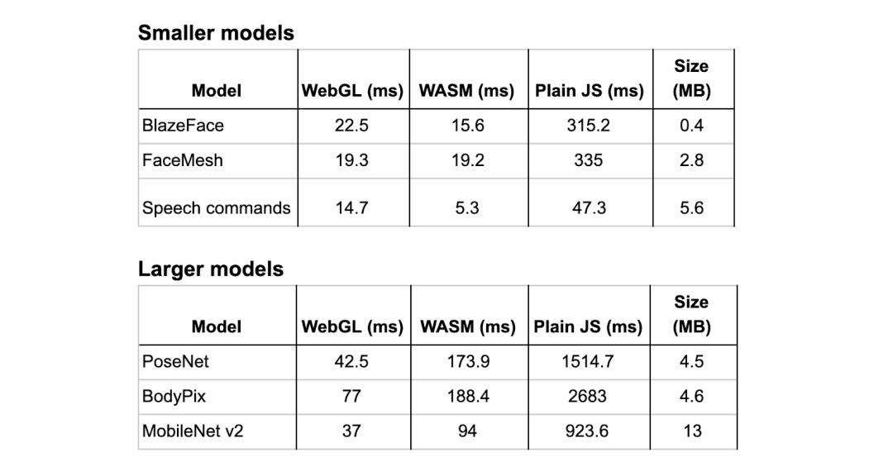
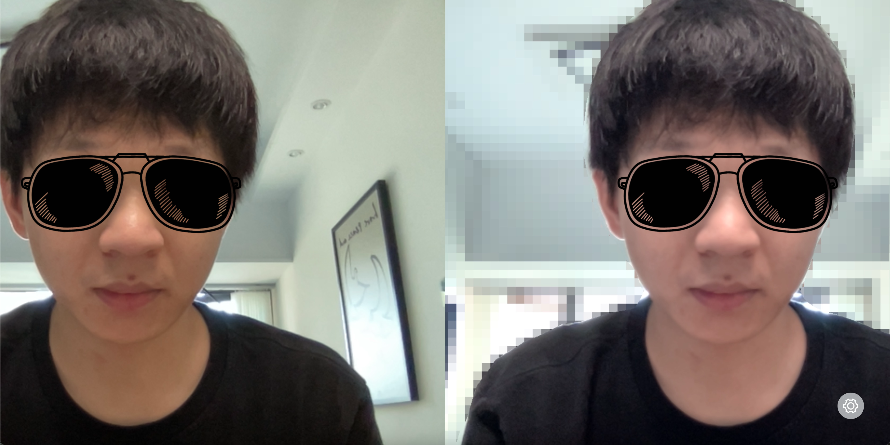
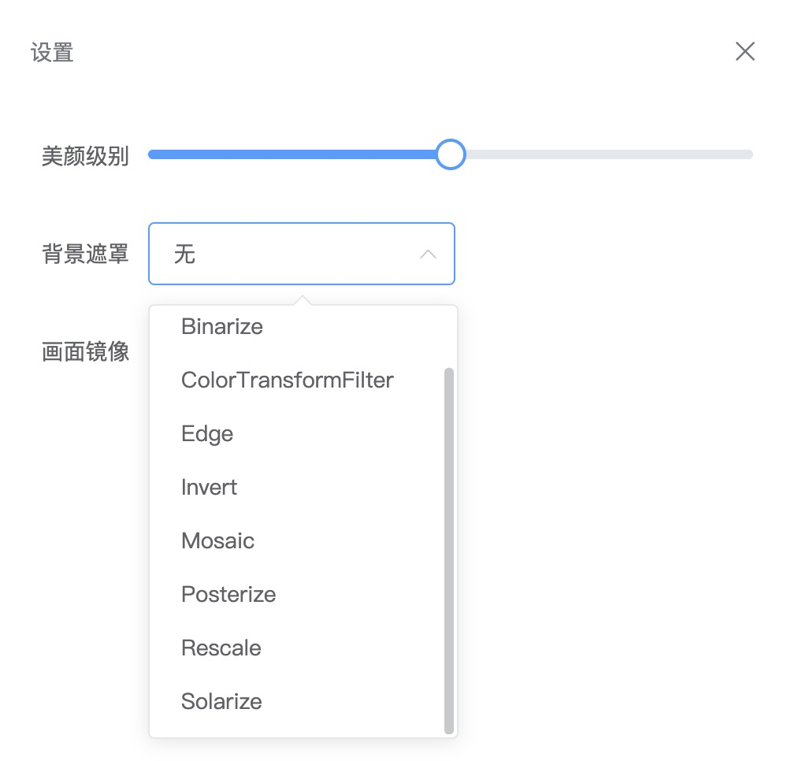
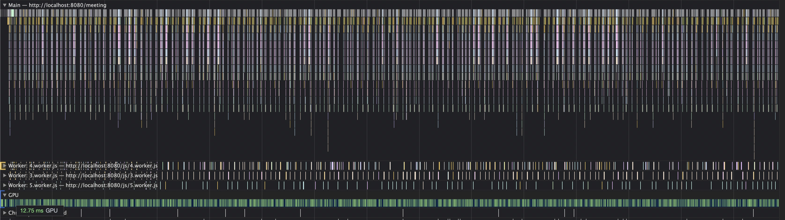

# 视频会议图像处理的纯web实现

随着全球疫情的蔓延，越来越多的组织选择了网上上课或者会议，各种各样的视频会议软件也应运而生。但是市面上网页版的视频会议工具仿佛还是很难见到，究竟什么制约的web在这个领域的发展？在WebRTC、Web Worker、WebAssembly、Web GUP等技术逐步成熟的背景下。是否能通过更底层的语言和多线程实现流畅的视频处理体验呢？带着这些问题我做了如下尝试，顺便可以研究一下新技术有哪些应用场景和存在的问题。

## 重点需求分析

参考了一些现有的视频会议软件，我发现背景虚化和美颜是相对比较重要的功能，对于保护隐私和提升视频效果有些很大的帮助，甚至可能决定了用户是否愿意打开摄像头。同时这也是比较考验性能部分，对前端的性能优化有着很大的挑战。

## 需求实现过程

### 获取摄像头数据

这一步主要是通过`navigator.mediaDevices.getUserMedia`API来实现，之前使用的`navigator.getUserMedia`已经废弃，但是旧版本的浏览器可能还在使用旧版API，可以通过安装`webrtc-adapter`npm包来兼容旧版浏览器。

### 显示摄像头画面

获取到摄像头数据以后可以通过video元素直接展示出来，具体实现的伪代码如下：
```js
const userMediaOptions = {
  audio: false, 
  video: { facingMode: 'user' },
};
const { getUserMedia } = navigator.mediaDevices;
video.srcObject = await getUserMedia(userMediaOptions);
video.play();
```
如果浏览器video元素不支持srcObject属性的话，也可以通过`window.URL.createObjectURL`方法将stream数据转换后直接赋值给video元素src属性来实现。

### 视频处理

视频处理我们是通过将视频帧绘制在canvas中，然后通过`getImageData`获取视频帧图像矩阵数据。视频矩阵数据和普通图片矩阵数据一样是`Uint8ClampedArray`格式数据,每个元素的值是0-255的正整数，每四个元素代表一个像素数据（RGBA）。此时我们就可以通过一些图形图像算法对这些数据进行处理了。


### 美颜磨皮实现

目前来看，现有算法中对于保护边缘细节最好的应该就是双边滤波了。双边滤波（Bilateral filter）是一种非线性的滤波方法，是结合图像的空间邻近度和像素值相似度的一种折衷处理，同时考虑空域信息和灰度相似性，达到保边去噪的目的。具有简单、非迭代、局部的特点。缺点就是对性能的挑战极大。

首先我们使用js代码尝试能否满足需求（代码很长而且也不是最终方案，所以就不贴代码了）。

答案是否定的，我们来看下性能分析。


可以看到主线程的一个task需要2秒+执行完成。都卡成幻灯片了，页面很难交互。

### 使用Web Worker优化

通过多线程的方式减少主线程的压力是否可以改善这种情况呢？

这里我选用了[threads.js]()库作为Web Worker创建和管理的工具，它在github有1.4k的star，支持多种环境，并且可以通过webpack插件进行构建。

经过多线程的优化后，我们可以看到此时的主线程中的任务耗时减少到10ms+了，但是视频的卡顿并没有得到缓解。


因为运算已经转移到了Worker线程，可以看到Worker线程中的任务时间跟优化前主线程的运行时间是差不多的。对于这种视频场景而言工作量并没有减少，只是转移了工作量。但画面渲染始终需要等运算完成才能呈现。只不过这样就不会影响页面其他操作而已，结果自然是是治标不治本的。



### 使用WebAssembly优化

目前我了解到的市面上有3种编译WebAssembly的方式，分别是emscripten、wasm-pack和webassembly.studio三种方式，它们各有利弊。

#### emscripten

主要支持语言: C/C++

优点：

相对而言最成熟最稳定，支持直接编译为asm.js，支持源码sourcemap调试 。

缺点：

安装依赖时可能要考虑python3和python2的共存问题，安装体验不是特别好。必须按照他提供的模块化方法组织代码，对于现在普遍使用打包工具工程化的项目不是很友好。

#### wasm-pack

仅支持Rust

优点：

wasm-pack有npm包的版本,并且有带文件监听自动编译的webpack插件，使用体验非常接近现在主流的web开发方式。

缺点：

目前仅支持Rust，目前感觉不是很稳定，会出现显示编译成功但是没有产物的问题。

#### webassembly.studio

支持C、TS和Rust

优点：

在线创建和编译，无需安装编译环境。

缺点：

虽然支持C不支持C++，不支持创建.h文件。

#### 使用opencv.wasm

opencv是一个非常强大的计算机视觉库，内置了bilateralFilter，并且支持编译成wasm文件，基本是满足我们需求的。

通过emscripten工具可以很方便生成opencv的wasm页面，同时还附带一个胶水js和一个html页面。具体生成方式可以看参考资料的最后一条。

也可以直接使用`opencv.js-webassembly`这个npm包，这个包使用起来非常方便，并且将opencv所有的方法都暴露在js胶水代码中，方便业务代码调用。

使用时候整体性能表现也是非常的不错。虽然运行在主线程中，每个任务基本都能在50ms内完成，相比之前的纯js方案已经有了非常大的提升。


#### GC回收

在运行了一段时间后还是发现了一个问题，视频会突然卡住，控制台报错："Cannot enlarge memory arrays"。可是performance面板中的JS Heap明明才3.6MB-4.2MB的占用，而且从曲线上也完全没有上升的趋势，内存怎么就溢出了呢？

通过浏览器自带的任务管理器发现当前tab页的内存使用竟已经2.2GB,才想起来WebAssembly中有些语言是需要自己垃圾回收的。在每次绘制canvas完成后回收掉之前创建的矩阵数据。


```js
export default async (src, width, height, quality) => {
  if (cv.calledRun) {
    // ImageData对象转Mat对象
    const mat = cv.matFromArray(height, width, cv.CV_8UC4, src);
    // 4通道mat对象转3通道mat（bilateralFilter仅支持1或者3通道，ImageData是4通道）
    cv.cvtColor(mat, mat, cv.COLOR_RGBA2RGB, 0);
    const temp = new cv.Mat(height, width, cv.CV_8UC3);
    await cv.bilateralFilter(mat, temp, quality, 75, 75, cv.BORDER_DEFAULT);
    cv.cvtColor(temp, temp, cv.COLOR_RGB2RGBA);
    // temp.data是数据引用，直接return会报错，构造新的Uint8ClampedArray数据
    const dst = Uint8ClampedArray.from(temp.data);
    // GC
    mat.delete();
    temp.delete();
    return dst;
  }
  return src;
};
```

#### 其他问题

opencv是一个很大的库（6M+），如何按需加载我用到的函数？而且现在quality设置到最低的情况下才能有较好的性能表现，但是这样的美颜效果是不明显的。而且基于WebAssembly其他方案也都有过尝试，无论是Rust还是C/C++都存在使用麻烦并且性能无法达到`real-time`的级别，再考虑到网络延时的情况，这对视频会议来说是完全不能接受的。

### WebGL

可能有很多同学跟我一样，在之前的认知中一直认为WebGL是用来做3D的，然而WebGL一样可以用于数据运算并且很强大。WebAssembly是相对于WebGL是更新的技术，事实上WebGL的`性能天花板`比WebAssembly高很多。我大胆立一个flag，无论任何语言，再好的算法（不使用GPU编程）实现的WebAssembly都不可能有WebGL的运算性能好。而且未来WebGUP功能发布以后更甚之。

这就要从CPU和GPU的架构说起了，如下图所示：




CPU主要用来进行通用计算，其更多的是注重控制，负责`逻辑性强的事物处理和串行计算`。GPU则没有复杂的控制逻辑，没有分支预测等这些组件，拥有有大量的`ALU（计算单元）`，专注于`执行高度线程化的并行计算任务`。这也就是为什么挖矿用的是GPU而不是CPU了，还有就是tfjs有两种性能较好的backend方案，虽然在小规模模型运算的情况下，WASM相比于WebGL有些优势，然而在大规模数据模型的场景下，WebGL可以说是完爆其他方案了。



如果是对`着色器语言（GLSL）`和`双边滤波算法`比较熟悉的同学可以考虑自己实现一下，我这里是基于网上开源的代码做了简单的重构实现的。重构部分主要是对输入输出参数做了调整，减少副作用和对dom的依赖。实现输入`ImageData`和相应的参数，返回ImageData的能力。可以理解为`纯函数化`，使这段代码也可以运行在`Web Worker`中。

最终调用伪代码如下：
```js
import { spawn, Worker } from 'threads';

const handleBilateralFilterWebgl = await spawn(new Worker('@/workers/handleBilateralFilterWebgl'));

const dstPixels = await handleBilateralFilterWebgl(
  resultVideo.data,
  resultVideo.width,
  resultVideo.height,
  beautifyLevel,
);
// dstPixels就是处理完的ImageData，可以拿来继续做其他处理，或者直接绘制到画布。
```

## 背景虚化实现

背景虚化的功能可以借助tfjs的BodyPix模型，BodyPix模型可以实时分割人物身体和背景，并且提供`bodyPix.drawBokehEffect`方法快速实现背景虚化，不过这并不是一个纯函数，并且会直接操作canvas元素，所以想通过`web Worker`的方式解决性能问题是行不通的。

实际上`net.segmentPerson`返回的已经是非常有效的数据了，`segmentation.data`是一个`Uint8Array`，它和`ctx.getImageData`返回的`Uint8Array`虽然不一样但是是有对应关系的。`ctx.getImageData`返回的数据最小值是0，最大值为255，每四个为一组代表一个像素的RGBA值。而`segmentation.data`返回的数据则比较纯粹，一个值就是一个像素，值的范围只有0和1，分别代表不属于人体的像素和属于人体的像素。

背景虚化一般是通过高斯模糊之类的模糊算法或者其他的滤镜算法达到无法分辨画面内容同时保持人物清晰的目的。基于canvas滤镜的工作原理就是遍历ImageData，通过一定公式实现对每个像素对RGBA值的更新，在这个过程中我们结合segmentation.data返回的数据就可以通过控制`不属于身体部分的像素更新值`和`属于身体部分的像素不更新值`来实现背景虚化。

调用伪代码如下：
```js
import { spawn, Worker } from 'threads';

const handleBodyPix = await spawn(new Worker('@/workers/handleBodyPix'));
const handleFilter = await spawn(new Worker('@/workers/handleFilter'));

let resultVideo;
const segmentation = await handleBodyPix(
  dstPixels,
  loadConfigs,
  segmentConfigs,
);
resultVideo = await handleFilter(filterType, [
  resultVideo,
  ...mask.filterParam,
  segmentation.data,
]);
```

## 效果

美颜和背景马赛克的效果（墨镜后期加上去的，防止暴露形象）。



目前共有10级美颜和8个背景可选



再看一下性能表现。



可以看到这个性能表现可以说是非常完美的，主线程、Worker线程和GPU都在非常均匀的运作，都没有出现`long task`，每个任务稳定在20ms以内。

### 在线预览

[http://9.134.51.24/meeting](http://9.134.51.24/meeting)
由于浏览器限制获取摄像头数据必须是https请求，这台云开发机并没有配置证书和域名，感兴趣的同学可以手动配置一下
1. 打开chrome://flags/#unsafely-treat-insecure-origin-as-secure
2. 在Insecure origins treated as secure一栏输入http://9.134.51.24并开启功能。

## 总结

在实现的过程中走了很多弯路，比如花了很多时间研究了WebAssembly，包括学习并试着修改C++和Rust实现的双边滤波算法和用更优雅的方式生成和引入WASM代码。最终发现很难达到预期的效果。当然多学一些知识也是没有什么坏处的。我觉得前端未来不管做不做3D，都应该学习和掌握一下WebGL、着色器语言和线性代数相关的知识。因为基于CPU的优化始终是有瓶颈的，要想突破的话，还是需要使用到GPU编程的。

## 愿景

后续在合适的时候，我会将代码开源出来，有同学对这个项目或者课题感兴趣的话，可以一起实现产品化或者创建一个oteam。

## 参考资料

[ImageFilters.js](https://github.com/zhengsk/ImageFilters.js)

[color-pop-effect-using-bodypix-and-tensorflow-js](https://towardsdatascience.com/color-pop-effect-using-bodypix-and-tensorflow-js-a584ddc48a02)

[imageRoutines](https://github.com/m0ose/imageRoutines)

[c++项目转成wasm全过程](https://zhuanlan.zhihu.com/p/158586853)

[emscripten-pointers-and-pointers](https://kapadia.github.io/emscripten/2013/09/13/emscripten-pointers-and-pointers.html)

[opencv-wasm](https://github.com/yaniswang/opencv-wasm)

[WebGL入门和实践](https://blog.csdn.net/qiwoo_weekly/article/details/102693931)
